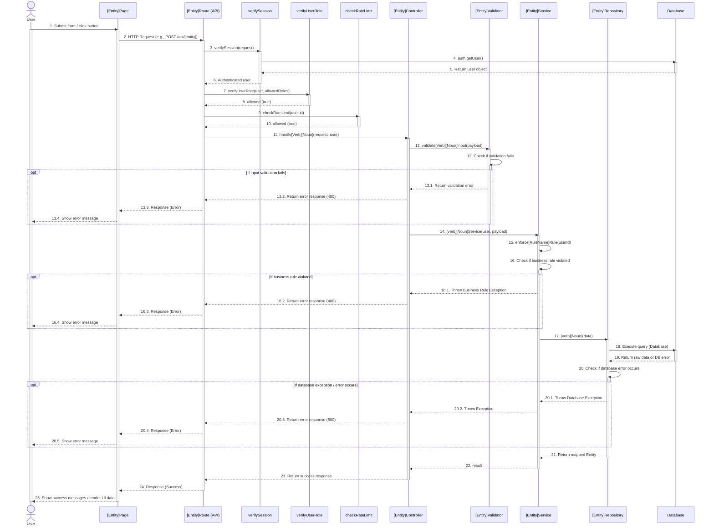

# HƯỚNG DẪN DÀNH CHO AGENT (AGENT INSTRUCTIONS) - SEQUENCE & CLASS DIAGRAM
Khi người dùng yêu cầu viết tài liệu "Sequence Diagram" hoặc "Class Diagram" cho một tính năng (feature), bạn (Agent) **PHẢI** tuân thủ chính xác cấu trúc Markdown dưới đây và bám sát kiến trúc hệ thống đã được quy định.

**🔴 QUY TẮC XUẤT BẢN TÀI LIỆU (QUAN TRỌNG):**
- **KHÔNG** tạo hay ghi trực tiếp các file `.md` chứa sơ đồ vào mã nguồn/thư mục dự án.
- **CHỈ** xuất ra nội dung đặc tả biểu đồ tuần tự (Sequence Diagram) và sơ đồ lớp (Class Diagram) dưới dạng mã **Mermaid Script** nằm trong các khối code block Markdown (fenced code blocks với ngôn ngữ `mermaid`) trực tiếp trong phản hồi chat (chế độ preview) để hiển thị trực quan và hỗ trợ người dùng sao chép mã nguồn sơ đồ dễ dàng.
- **BẮT BUỘC** đi kèm sơ đồ là danh sách liệt kê các file vật lý tương ứng với từng tầng (layer) để minh họa luồng đi khái quát của tính năng đó (ví dụ: UI -> Client API -> Route -> Controller -> Service -> Repository -> Database Table).

**🔴 QUY TẮC PHÂN LỚP KIẾN TRÚC VÀ ĐẶT TÊN (BẮT BUỘC TUÂN THỦ):**
Hệ thống sử dụng Next.js + Database.
- **Sequence Diagram:** Phải thể hiện luồng từ Frontend (Page chứa feature) gọi trực tiếp xuống API Backend. Bỏ qua các chi tiết như Hook hay hàm call API ở Client. Ở Backend, luồng đi trực tiếp từ **Repository xuống Database** (không vẽ Entity thành lifeline riêng mà chỉ ghi nhận Entity là kiểu dữ liệu phản hồi giữa các tầng).
- **Tên Entity:** Tên của Entity trong các biểu đồ phải dựa trên tên bảng cơ sở dữ liệu ở dạng số ít (ví dụ: bảng "plans" thì entity là "Plan", bảng "subscriptions" thì entity là "Subscription").
- **Class Diagram:** CHỈ vẽ và mô tả 4 lớp cốt lõi phía Backend: **Controller, Service, Repository, và Entity**.

---

## 1. Mẫu Sequence Diagram (Biểu đồ tuần tự)

### [X.Y] Sequence Diagram: [Tên Feature, ví dụ: Create Task]

**Mô tả luồng thực thi (Flow Description):**
*(Ghi chú: Mô tả chi tiết từng bước theo đúng sơ đồ bên dưới, đặc biệt nhấn mạnh đoạn UI gọi thẳng API Route và đoạn Repository khởi tạo Entity trước khi thao tác Database)*

**Sơ đồ (Mermaid):**


---

## 2. Mẫu Class Diagram & Class Description (Backend Core Only)

### [X.Z] Class Diagram: [Tên Feature]

*(Ghi chú: Sơ đồ lớp tập trung vào Router, Controller, Service, Repository và Entity)*

**Sơ đồ (Mermaid):**
```mermaid
classDiagram
    class [Entity]Router {
        -[Entity]Controller: [Entity]Controller
        +GET /api/[entities]
        +POST /api/[entities]
    }
    class [Entity]Controller {
        -[Entity]Service: [Entity]Service
        +handle[Verb][Noun](req)
    }
    class [Entity]Service {
        -[Entity]Repository: [Entity]Repository
        +[verb][Noun]Service(data)
    }
    class [Entity]Repository {
        -[Entity]Entity: [Entity]Entity
        +getAll[Entities]()
        +get[Entity]ById(id)
    }
    class [Entity]Entity {
        +id: number
        +created_at: string
    }

    [Entity]Router ..> [Entity]Controller
    [Entity]Controller --> [Entity]Service
    [Entity]Service --> [Entity]Repository
    [Entity]Repository ..> [Entity]Entity : use
```

### Chi tiết các lớp (Class Description)

*(Ghi chú cho Agent: Cấu trúc bảng mô tả Class gồm 3 cột: No, Method (signature), Description. Chỉ liệt kê 4 class dưới đây).*

#### 1. Lớp Controller (`[Entity]Controller`)
**Mô tả:** Tiếp nhận request đã qua middleware, điều phối Validator và Service.
| No | Method (Signature) | Description |
| :--- | :--- | :--- |
| 1 | `handle[Verb][Noun](req, user)` | Xử lý request, gọi kiểm tra input và chuyển dữ liệu cho Service. |

#### 2. Lớp Service (`[Entity]Service`)
**Mô tả:** Chứa logic nghiệp vụ lõi và ràng buộc Business Rule.
| No | Method (Signature) | Description |
| :--- | :--- | :--- |
| 1 | `[verb][Noun]Service(...)` | Xử lý nghiệp vụ chính của tính năng. |
| 2 | `enforce[RuleName]Rule(...)` | Internal business rule thực thi quy tắc của hệ thống. |

#### 3. Lớp Repository (`[Entity]Repository`)
**Mô tả:** Thao tác trực tiếp với Database, thực hiện ánh xạ qua Entity.
| No | Method (Signature) | Description |
| :--- | :--- | :--- |
| 1 | `[verb][Noun](data)` | Truy vấn CSDL (Supabase) và map raw data thành Entity. |

#### 4. Lớp Entity (`[Entity]Model`)
**Mô tả:** Đối tượng đại diện cho cấu trúc dữ liệu trong hệ thống.
| No | Properties/Attributes | Description |
| :--- | :--- | :--- |
| 1 | `[Thuộc tính của Entity]` | Mô tả các trường dữ liệu ánh xạ từ Database. |

---

## 3. Mẫu Luồng đi khái quát của các file và tầng xử lý (Overall Data Flow & Physical Files)

*(Ghi chú cho Agent: Cung cấp danh sách ánh xạ các file thực tế tham gia vào luồng xử lý của tính năng này)*

*   **Tầng UI (Client Component):** `src/app/...`
*   **Tầng Client API (Fetcher call):** `src/features/[feature_name]/api/...`
*   **Tầng Route Handler (Next.js API):** `src/app/api/.../route.ts`
*   **Tầng Controller (Server-side):** `src/features/[feature_name]/controller/...`
*   **Tầng Service (Business Logic):** `src/features/[feature_name]/service/...`
*   **Tầng Repository (Database CRUD):** `src/features/[feature_name]/repository/...`
*   **Tầng Database (Table/Supabase):** Table `...`
