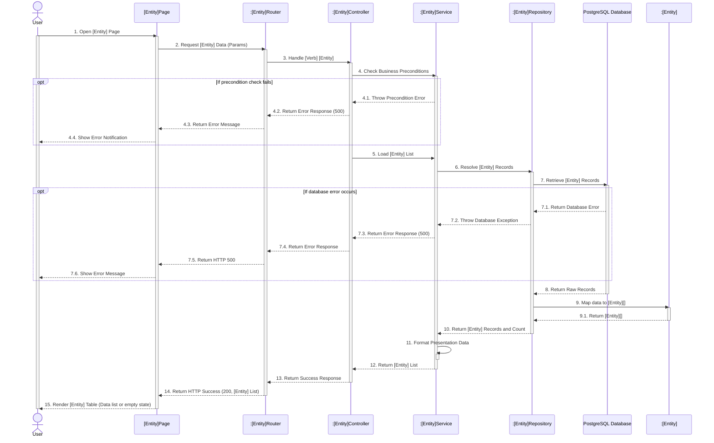

# HƯỚNG DẪN DÀNH CHO AGENT (AGENT INSTRUCTIONS) - SEQUENCE & CLASS DIAGRAM
Khi người dùng yêu cầu viết tài liệu "Sequence Diagram" hoặc "Class Diagram" cho một tính năng (feature), bạn (Agent) **PHẢI** tuân thủ chính xác cấu trúc Markdown dưới đây và bám sát kiến trúc hệ thống đã được quy định.

**🔴 QUY TẮC XUẤT BẢN TÀI LIỆU (QUAN TRỌNG):**
- **KHÔNG** tạo hay ghi trực tiếp các file `.md` chứa sơ đồ vào mã nguồn/thư mục dự án khi chưa có yêu cầu.
- **CHỈ** xuất ra nội dung đặc tả biểu đồ tuần tự (Sequence Diagram) và sơ đồ lớp (Class Diagram) dưới dạng mã **Mermaid Script** nằm trong các khối code block Markdown (fenced code blocks với ngôn ngữ `mermaid`) trực tiếp trong phản hồi chat (chế độ preview) để hiển thị trực quan và hỗ trợ người dùng sao chép mã nguồn sơ đồ dễ dàng.
- **BẮT BUỘC** đi kèm sơ đồ là danh sách liệt kê các file vật lý tương ứng với từng tầng (layer) để minh họa luồng đi khái quát của tính năng đó (UI -> Route -> Controller -> Service -> Repository -> Database Table & Model).

**🔴 QUY TẮC PHÂN LỚP KIẾN TRÚC VÀ ĐẶT TÊN (BẮT BUỘC TUÂN THỦ):**
Hệ thống sử dụng Next.js (App Router) + TypeScript + Database (Supabase/PostgreSQL).
1. **Quy tắc từ ngữ (Wording):**
   - Sử dụng từ ngữ tiếng Anh **ngắn gọn, dễ hiểu, đúng mục đích nghiệp vụ** (dạng Verb + Noun: ví dụ: `Open Contracts Page`, `Handle Get Contracts`, `Retrieve Contracts Records`).
   - **Tuyệt đối KHÔNG dùng ký tự đặc biệt** gây lỗi phân tích cú pháp Mermaid hoặc làm rối sơ đồ (tránh dùng dấu ngã `~`, gạch đứng `|`, dấu ngoặc nhọn `{}` lồng trong tham số hàm, hoặc các chuỗi tham số code dài dòng).
2. **Quy tắc luồng thực thi chuẩn (Sequence Flow):**
   - **Bắt buộc tuân thủ 100% thứ tự luồng đi:**
     `Actor` $\rightarrow$ `Page` $\rightarrow$ `:Router` $\rightarrow$ `:Controller` $\rightarrow$ `:Service` $\rightarrow$ `:Repository` $\rightarrow$ `Database` $\rightarrow$ `:Repository` $\rightarrow$ `:InterfaceModel` $\rightarrow$ `:Repository` $\rightarrow$ `:Service` $\rightarrow$ `:Controller` $\rightarrow$ `Page` $\rightarrow$ `Actor`
   - **Vị trí của Model/Entity:** BẮT BUỘC có Lifeline Model (ví dụ: `:[Entity]`) trên Sequence Diagram để đồng nhất 1-1 với Class Diagram. Sau khi Repository nhận dữ liệu thô từ Database, Repository sẽ gửi thông điệp `Map data to [Entity][]` sang Lifeline Model, Model trả về tập thực thể đã map cho Repository.
3. **Quy tắc xử lý điều kiện (Control Frames):**
   - **KHÔNG dùng khung `alt`** phức tạp.
   - **CHỈ dùng khung `opt`** cho các trường hợp kiểm tra lỗi (ví dụ: `opt If validation fails`, `opt If business rule violated`, `opt If database error occurs`).
   - **Luồng chính (Happy path / luồng bình thường):** Chạy thẳng mượt mà từ đầu đến cuối không bị ngắt quãng.
4. **Quy tắc Class Diagram:**
   - Các lớp xử lý (`Router`, `Controller`, `Service`, `Repository`) là dạng stateless function modules trong TypeScript, **không để thuộc tính** (để trống ngăn thuộc tính).
   - Quan hệ giữa các lớp xử lý và Model dùng **mũi tên nét đứt có hướng (Dependency `..>`)** với nhãn `<<call>>` hoặc `<<use>>`.
   - Lớp `[Entity]` (Model) chứa danh sách các thuộc tính dữ liệu sạch sẽ, đúng theo interface trong mã nguồn.

---

## 1. Mẫu Sequence Diagram (Biểu đồ tuần tự)

### [X.Y] Sequence Diagram: [Tên Feature, ví dụ: View Contracts]

**Mô tả luồng thực thi (Flow Description):**
*(Ghi chú: Mô tả chi tiết từng bước theo đúng sơ đồ bên dưới, nêu rõ luồng từ UI qua API, xuống Repository query Database, sau đó Repository map dữ liệu qua Interface Model trước khi trả ngược lại Service -> Controller -> UI).*

**Sơ đồ (Mermaid):**


---

## 2. Mẫu Class Diagram & Class Description (Backend Core Only)

### [X.Z] Class Diagram: [Tên Feature]

*(Ghi chú: Sơ đồ lớp thể hiện kiến trúc phân tầng Next.js App Router, Controller, Service, Repository và Interface Model)*

**Sơ đồ (Mermaid):**
```mermaid
classDiagram
    class [Entity]Router {
        +GET(request)
        +POST(request)
    }
    class [Entity]Controller {
        +handleGet[Entities](params)
        +handleCreate[Entity](payload)
    }
    class [Entity]Service {
        +get[Entities]Service(params)
        +check[Precondition]Service(id)
    }
    class [Entity]Repository {
        +get[Entities](params)
        +get[Entity]ById(id)
    }
    class [Entity] {
        +string id
        +string created_at
        +string status
    }

    [Entity]Router ..> [Entity]Controller : calls
    [Entity]Controller ..> [Entity]Service : calls
    [Entity]Service ..> [Entity]Repository : calls
    [Entity]Repository ..> [Entity] : maps
    [Entity]Service ..> [Entity] : uses
```

### Chi tiết các lớp (Class Description)

#### 1. Lớp Router (`[Entity]Router`)
**Mô tả:** Next.js Route Handler tiếp nhận HTTP Request, giải mã query/body params và điều phối sang Controller.
| No | Method (Signature) | Description |
| :--- | :--- | :--- |
| 1 | `GET(request: NextRequest)` | Tiếp nhận request tra cứu danh sách thực thể và trả về NextResponse. |

#### 2. Lớp Controller (`[Entity]Controller`)
**Mô tả:** Điều phối luồng dữ liệu, kiểm tra quyền truy cập/gói dịch vụ và gọi sang Service tương ứng.
| No | Method (Signature) | Description |
| :--- | :--- | :--- |
| 1 | `handleGet[Entities](params)` | Xử lý request tra cứu danh sách, gọi Service kiểm tra điều kiện và tải dữ liệu. |

#### 3. Lớp Service (`[Entity]Service`)
**Mô tả:** Chứa logic nghiệp vụ cốt lõi, kiểm tra ràng buộc nghiệp vụ và định dạng dữ liệu trả về cho client.
| No | Method (Signature) | Description |
| :--- | :--- | :--- |
| 1 | `get[Entities]Service(params)` | Thực hiện nghiệp vụ lấy dữ liệu danh sách và tính toán thông tin hiển thị. |
| 2 | `check[Precondition]Service(id)` | Kiểm tra điều kiện tiên quyết hoặc trạng thái hoạt động của đối tượng. |

#### 4. Lớp Repository (`[Entity]Repository`)
**Mô tả:** Thao tác trực tiếp với Database (Supabase/PostgreSQL) và ánh xạ dữ liệu nhận được sang Interface Model.
| No | Method (Signature) | Description |
| :--- | :--- | :--- |
| 1 | `get[Entities](params)` | Truy vấn CSDL, nhận raw records và map thành mảng đối tượng `[Entity][]`. |

#### 5. Lớp Thực thể (`[Entity]Model` / `[Entity]Interface`)
**Mô tả:** Đối tượng dữ liệu nghiệp vụ (Domain Entity / Interface) đại diện cho cấu trúc bảng CSDL trong ứng dụng.
| No | Properties/Attributes | Description |
| :--- | :--- | :--- |
| 1 | `[Thuộc tính của Entity]` | Các trường dữ liệu định danh, trạng thái và thời gian của thực thể. |

---

## 3. Mẫu Luồng đi khái quát của các file và tầng xử lý (Overall Data Flow & Physical Files)

*   **Tầng UI (Client Page):** `src/app/(features)/[feature_name]/page.tsx`
*   **Tầng Route Handler (Next.js API):** `src/app/api/[feature_name]/route.ts`
*   **Tầng Controller (Server-side):** `src/features/[feature_name]/controller/[feature_name].controller.ts`
*   **Tầng Service (Business Logic):** `src/features/[feature_name]/service/[feature_name].service.ts`
*   **Tầng Repository (Database CRUD):** `src/features/[feature_name]/repository/[feature_name].repository.ts`
*   **Tầng Model / Interface:** `src/types/[Entity].ts`
*   **Tầng Database (Table/PostgreSQL):** Table `[entities]`

